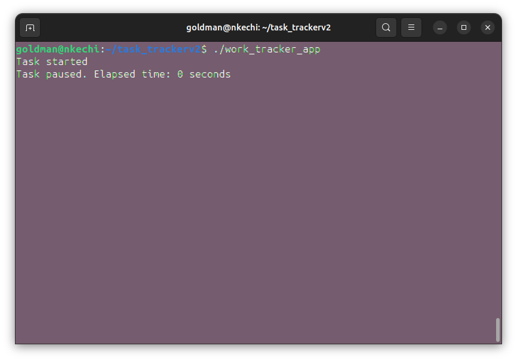

# legendary-pancake

### Compile
<em>g++ -o work_tracker_app main.cpp `pkg-config gtkmm-3.0 --cflags --libs` -lX11</em>  
## Run
<em>./work_tracker_app</em>

## Application UI

## The user time and activity is displayed in the console

